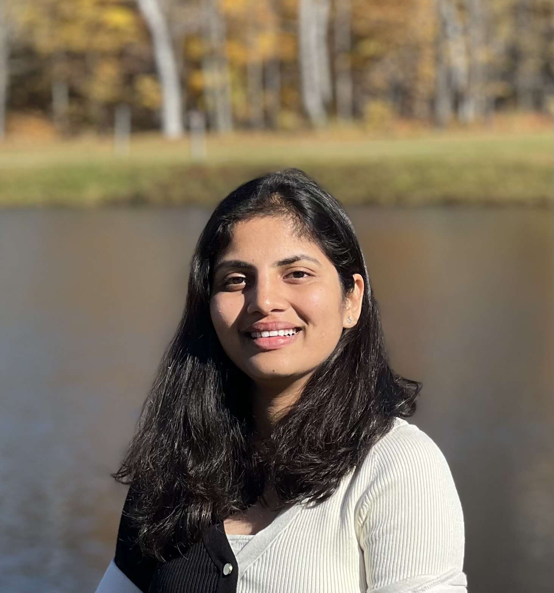

# Lavanya Telapudi

## Education

**Master’s of Professional Studies in Data Science**  
University of Maryland Baltimore County  
January 2022 – December 2023  
GPA: 3.96

**Bachelor of Engineering in Electronics Engineering**  
Chaitanya Bharathi Institute of Technology  
May 2017 – May 2021  
GPA: 4.0

## Programming Skills

- Programming Languages: Python, R, Javascript, C
- Design / Analysis: Data Structures and Algorithms, OOP
- Databases: MySQL
- Machine Learning: Linear Regression, Deep Learning, Decision Tree, CNN, SVM, Logistic Regression, Random Forest, Naive Bayes, NLP
- Machine Learning Frameworks: PyTorch, TensorFlow
- Big Data Technologies: AWS S3, AWS Glue, Hadoop, PySpark, Databricks, Kubernetes
- Data Visualization Tools: Tableau
- Dev Tools / Applications: Git, Microsoft Excel

## Professional Experience

**Application Development Associate**  
Accenture, Hyderabad, India  
August 2021 - January 2022

- Built components, interfaces, and channels for file flow
- Developed logic transformation in Java for SAP PI
- Experience with both on-premise and cloud systems in SAP ECC
- Identified and solved flow errors, provided support in critical situations

**Summer Intern**  
Aurora Solutions, Hyderabad, India  
May 2019 - June 2019

- Knowledge in databases and large-scale storage systems
- Utilized Excel with VBA for data management and analysis
- Understood ITIL framework and cloud computing architecture

## Academic Projects

[**Retention of Players in the NBA Team**](https://github.com/lavanyatelapudi/Academic_Projects/tree/main/NBA%20Data%20Analysis) 
- Predicted player retention for the next NBA season
- Used regression and classification algorithms
- Compared F1-scores of various models

[**Housing Market Data Analysis**](https://github.com/lavanyatelapudi/Academic_Projects/tree/main/Housing%20Market%20Data%20Analysis)  
- Created MySQL database, migrated to AWS RDS using AWS Glue
- Preprocessed data in Excel, visualized insights with Tableau

[**POS for Event Management System**](https://github.com/lavanyatelapudi/Academic_Projects/tree/main/Event%20Management%20POS) 
- Designed POS using OOP concepts
- Implemented encapsulation, inheritance, and abstraction

[**Motor Vehicles Collision Analysis in NYC**](https://github.com/lavanyatelapudi/Academic_Projects/tree/main/Motor%20Vehicle%20Collision) 
- Ingested data using HDFS, performed EDA with Spark, scikit-learn, Dask

**Door Unlocking System based on Facial Recognition**  
- Designed facial recognition system using OpenCV
- Implemented machine learning algorithms

## Achievements

- Robotics club board member
- Machine Learning Bootcamp attendee
- Executive Body Member of NSS
- Captain of National Cadet Corps(NCC)
- Member of Scouts and Guides
